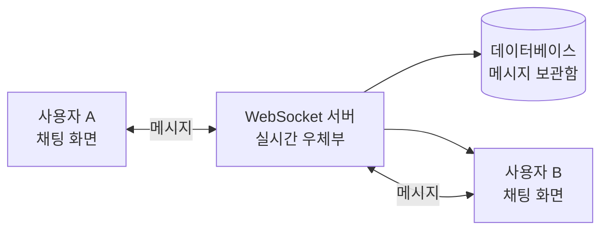
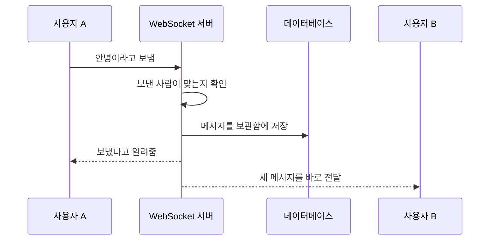

# WebSocket 쉽게 이해하기

## WebSocket란?

WebSocket은 **인터넷으로 실시간 대화를 할 수 있게 해주는 방법**이다.

친구와 전화 통화를 한다고 생각해 보자. 전화를 한 번 연결하면 서로 번갈아 전화를 걸지 않아도 바로 이야기를 주고받을 수 있다. WebSocket도 컴퓨터와 서버를 계속 연결해 둔다.

그래서 채팅방에 새 메시지가 오면 서버가 기다리지 않고 바로 우리 화면에 알려줄 수 있다.

## HTTP와 WebSocket의 차이

HTTP는 편지를 보내는 것과 비슷하다. 내가 편지를 보내야 상대방이 답장을 보낸다.

WebSocket은 전화 통화와 비슷하다. 연결만 되어 있으면 어느 쪽이든 바로 말을 시작할 수 있다.

| 구분              | HTTP                         | WebSocket                            |
| ----------------- | ---------------------------- | ------------------------------------ |
| 쉬운 비유         | 편지 주고받기                | 전화 통화하기                        |
| 연결              | 필요할 때 요청하고 답을 받음 | 한 번 연결하면 계속 연결됨           |
| 누가 먼저 말하나? | 보통 컴퓨터가 먼저 물어봄    | 컴퓨터와 서버 모두 먼저 말할 수 있음 |
| 새 소식 알림      | 컴퓨터가 자주 물어봐야 함    | 서버가 새 소식을 바로 알려줌         |
| 잘 어울리는 곳    | 홈페이지 보기, 물건 주문하기 | 채팅, 실시간 알림, 온라인 게임       |

## 실시간 채팅 서비스 구조

채팅 서비스에는 보통 다음 세 가지가 있다.

- **내 컴퓨터**: 내가 메시지를 쓰는 곳
- **WebSocket 서버**: 친구에게 메시지를 전달해 주는 우체부
- **데이터베이스**: 메시지를 안전하게 보관하는 공책

### 메시지가 전달되는 순서

### 실제로 일어나는 일

1. 사용자가 채팅방을 열면 컴퓨터와 서버가 전화처럼 연결된다.
2. 사용자가 메시지를 쓰고 보내기 버튼을 누른다.
3. 서버가 메시지를 받아서 누구에게 보낼지 확인한다.
4. 서버는 메시지를 데이터베이스에 보관한다.
5. 서버는 같은 채팅방에 있는 친구들에게 메시지를 바로 보낸다.
6. 친구의 화면에 새 메시지가 나타난다.

## 각 부분이 하는 일

- **채팅 화면**: 메시지를 쓰고 보여준다.
- **WebSocket 서버**: 메시지를 받아서 알맞은 친구에게 전달한다.
- **데이터베이스**: 예전 메시지를 잊어버리지 않도록 보관한다.
- **로그인 확인**: 채팅방에 들어와도 되는 사람인지 확인한다.

## 꼭 챙겨야 하는 것

- 인터넷이 끊겼다가 다시 연결되면 자동으로 다시 연결하기
- 로그인한 사람만 채팅방을 사용할 수 있게 하기
- 메시지를 안전하게 저장하기
- 서버와 주고받는 내용을 다른 사람이 훔쳐보지 못하게 하기

한마디로 정리하면, **WebSocket은 컴퓨터와 서버 사이에 계속 열어 두는 전화선이고, 서버는 친구에게 메시지를 전달해 주는 우체부**이다.

3. WebSocket
   1. `npm install ws`
      - server.js
        - WebSocketServer
          - wss.on("connection", (ws) => {});
            - ws.on("close",() => {});

        - client.js
        - WebSocket
          - ws.onopen = () => {};
          - ws.onclose = () => {};
